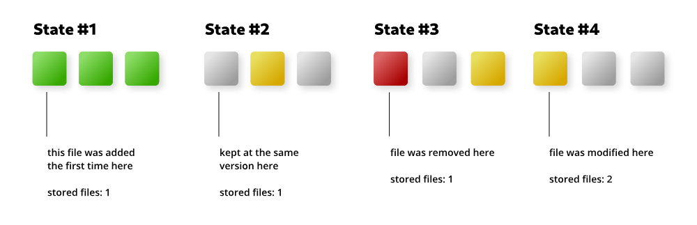

# FVS
File Versioning System with hash comparison and data storage to create unlinked 
states that can be deleted

> ⚠️ This is currently a Beta.

### Why FVS?
The main reason for this project is for the purpose of personal knowledge and 
understanding of the versioning system. The second reason is to make a simple
and easy-to-implement versioning system for [Bottles](https://github.com/bottlesdevs/Bottles).

There are plenty of other versioning systems out there, but all of these 
provide features that I wouldn't need in my projects. The purpose of FVS is to 
always remain as clear and simple as possible, providing only the functionality 
of organizing file versions into states, ie recovery points that take advantage 
of deduplication to minimize space consumption.

### Dependencies
FVS only need the `orjson` python package.

### Concept
With the following images, we can see the basic concept of FVS and how it works.

In the following examples we will investigate only the first file cell, the
others follow the same concept and should be easy to understand.


As you can see, the first file was added, removed and re-added but FVS always 
kept only one copy of that file as it was always the same version.



The example above shows a different timeline. In State #4 a new file has been 
added in the same place as the one in State #1 but since it is a different 
file, FVS is keeping two files in its storage.

Since the second version of the file is used only by State #4, if we were to 
restore one of the previous States, FVS will permanently delete that file as 
it is not necessary for the other States, this is because FVS per concept 
does not allow travel to the future, so all the States after the restored one 
are deleted.

### Install
```bash
python setup.py install  # --user for user-local install
```

### CLI usage
```bash
> mkdir repo ; cd repo
> fvs init  
# with custom path: fvs init --path <path>
# with compression turned on: fvs init --use-compression
Initialized FVS repository in /your/location/repo

> touch hello.txt
> fvs commit -m "First state"  # -i=<pattern> -i=<pattern2> to ignore files
Committing...
Committed state 0

> echo "Hello world!" >> hello.txt
> fvs commit -m "Second state"
Committing...
Committed state 1

> fvs states
-   0 First state
- ➔ 1 Second state

> fvs restore -s 0
Restored state 0

> fvs active
Active state is 0
```

### Lib usage

```python
from fvs import FVSRepo

# create a new repo or point to an existing one
repo = FVSRepo("just/one/path")

# add some new files
with open("test/hello.txt", "w") as f:
    f.write("Hello world!")
    
with open("test/ciao.txt", "w") as f:
    f.write("Ciao!")

# commit the changes
repo.commit("My first state!")

# add some more files
with open("test/test.txt", "w") as f:
    f.write("Hello world again!")

with open("test/test.ignore", "w") as f:
    f.write("This time nobody will see this!")

# commit the changes ignoring files with .ignore extension
repo.commit("My second state!", ignore=["*.ignore"])

# restore the state 1
repo.restore_state(1)
```
